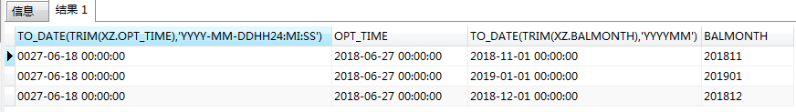

挺神奇的。

<!--more-->

```sql
SELECT
	TO_DATE(TRIM(xz.OPT_TIME), 'YYYY-MM-DD hh24:MI:ss' ),
	xz.OPT_TIME,
	TO_DATE( TRIM( xz.BALMONTH ), 'yyyymm' ),
	xz.BALMONTH 
FROM
	"T_hefeixin_member_xz" xz
WHERE
	xz.MOBILE = '******';
```


  

  




**而同样的逻辑和原始数据，在MySQL中是正常的。**

```sql
SELECT
	str_to_date( TRIM( sds_member_xz.OPT_TIME ), '%Y-%m-%d %H:%i:%S %T' ),
	sds_member_xz.OPT_TIME 
FROM
	`sds_member_xz` 
WHERE
	sds_member_xz.MOBILE = '******';
```


  

  



目前分析认为，该现象的出现跟数据库日期格式设定、导入时的日期格式设定有关。

当前数据源可通过"dd-mm-yy hh24:MI:ss"得到正确结果。


  

  

