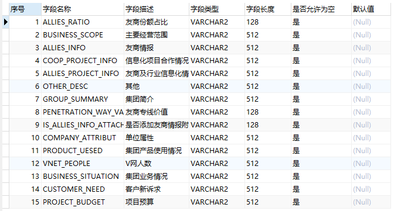
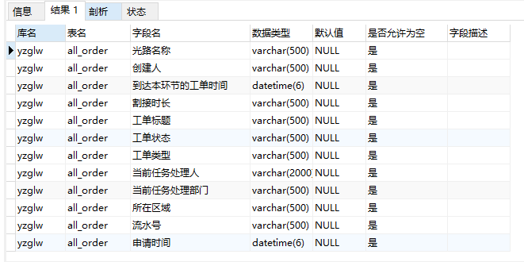

要求能连接上数据库且具有查询表结构的权限

<!--more-->

### Oracle

#### 执行语句

```sql
SELECT  ROWNUM 序号,A.COLUMN_NAME AS "字段名称",B.comments AS "字段描述",
A.DATA_TYPE as 字段类型,
REPLACE(DECODE(A.CHAR_LENGTH,0,DECODE(A.DATA_SCALE,NULL,A.DATA_TYPE,A.DATA_PRECISION||','||A.DATA_SCALE),A.CHAR_LENGTH),',0','') 字段长度,
 
REPLACE(REPLACE(A.NULLABLE,'Y','是'),'N','否') AS "是否允许为空",
A.DATA_DEFAULT AS "默认值"
FROM sys.all_tab_columns A,sys.DBA_COL_COMMENTS B
WHERE A.owner=B.owner AND A.table_name=B.table_name  AND A.COLUMN_NAME=B.COLUMN_NAME AND A.owner='用户名'  AND
A.TABLE_NAME IN (
'表名'
)
---可根据需要进行排序
ORDER BY A.TABLE_NAME 
```

#### 效果


  

  



### MySQL

#### 执行语句

```mysql
SELECT
    t.TABLE_SCHEMA AS 库名,
    t.TABLE_NAME AS 表名,
    t.COLUMN_NAME AS 字段名,
    t.COLUMN_TYPE AS 数据类型,
    CASE IFNULL(t.COLUMN_DEFAULT,'Null') 
        WHEN '' THEN '空字符串' 
        WHEN 'Null' THEN 'NULL' 
        ELSE t.COLUMN_DEFAULT END  AS 默认值,
    CASE t.IS_NULLABLE WHEN 'YES' THEN '是' ELSE '否' END AS 是否允许为空,
    t.COLUMN_COMMENT AS 字段描述
FROM information_schema.COLUMNS t 
WHERE t.TABLE_SCHEMA='库名' AND t.TABLE_NAME in ('表名')
-- 可根据需要进行排序
ORDER BY t.TABLE_SCHEMA,t.TABLE_NAME,t.COLUMN_NAME;
```

#### 效果


  

  

