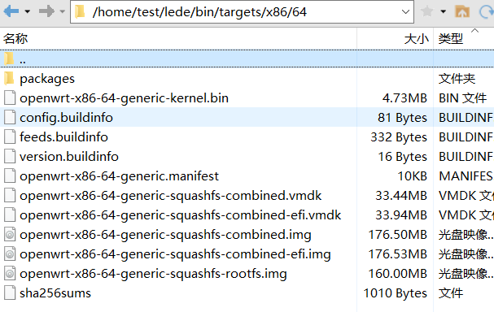
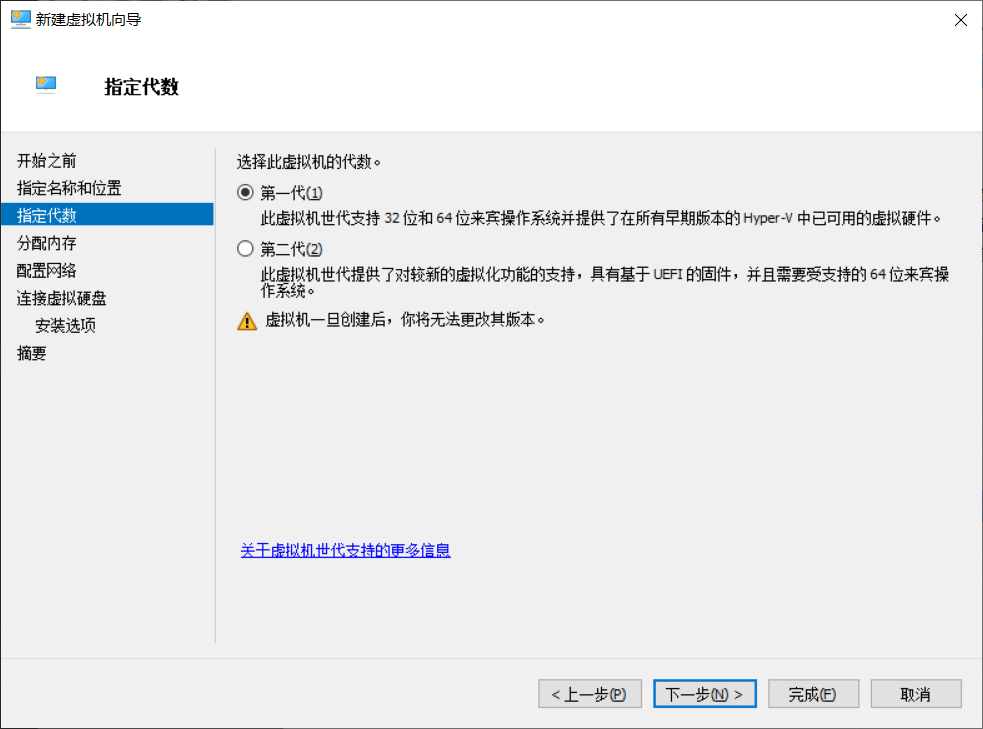
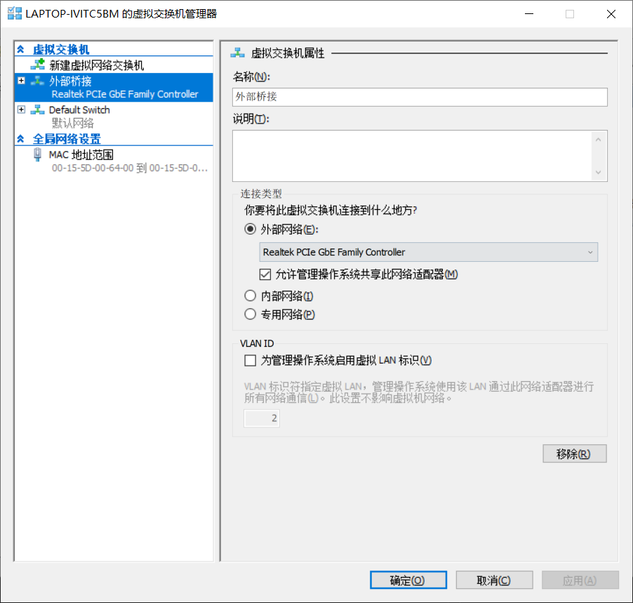

**需求**  

魔法上网  

火箭耗电大，待机一晚上由它带来的额外耗电大约在6-8%，且每个终端都装工具过于繁琐

<!--more-->
**实现思路**  

将路由选择的活由终端转交给专业的路由  

然而房间里路由器（主路由器）过于低端..不支持三方固件本身也未提供相关功能。于是在文章<<[从听说到上手，人人都能看懂的旁路由入门指南](https://sspai.com/post/59708)>>、<<[Hyper-v使用自编译Openwrt(X86)做旁路由的配置指南](https://zhuanlan.zhihu.com/p/110669725)>>的指导下,我决定以旁路由的形式为主路由器扩展功能。  

旁路由的原理是把路由器的功能再行细分，主路由只保留拨号上网、AP点等网络连接基础功能，而路由选择、防火墙等功能转由旁路由实现，终端设备的网关均为旁路由。数据包在发往互联网前通过主路由转至旁路由，由旁路由做相应处理后再交由主路由发向互联网。  

旁路由的实现方式有很多，大致可以分为硬件实现、软件实现两种。其中硬件实现就是额外添置具备相关功能的路由设备，软件实现就是利用现有计算机虚拟一台路由设备（亦称软路由）并将其和主路由器相连。

>然而领导不让买额外的硬件，我只能走软路由的路了..  

**大致过程**  

首先去下[lede开源代码](https://github.com/coolsnowwolf/lede)，喜欢稳定些的版本也可以下[Openwrt稳定版代码](https://github.com/coolsnowwolf/openwrt)。
> 用了这些天，lede也没见着哪不稳定。为防作者删代码跑路，也已经fork了一份 :）  

下源代码的时候按照项目说明准备编译环境，用hyper-V虚拟了一个Ubuntu 18 LTS x64，并按项目说明进行编译（耗时5小时），编译结果如下图所示：  

  

  
>建议使用 Xshell 连接Ubuntu，而不是通过hyper-V进行连接，方便复制粘贴命令

>执行make menuconfig命令后进入的编译配置页面可以选上后续魔法上网需要的基础包，也可以不做改动，后续再装，都行

这里使用 openwrt-x86-64-generic-squashfs-combined.vmdk 文件以建立运行着路由器固件的虚拟机（软路由虚拟机），将其拷贝至Windows宿主机中，使用StarVind V2V Converter转为 .vhd 格式，建立并启动软路由虚拟机。  
>！！注意！！**新建openwrt虚拟机时必须选择1代虚拟机**  
>
>  
>
>    

>内存分配512M足矣

>建议将软路由虚拟机的网卡桥接至宿主机中以获得更好的性能
>
>  
>
>    

启动Openwrt后先别急着通过浏览器访问后台管理页面，因为默认管理地址大概率会和现行主路由的管理地址冲突，需要先通过hyper-V连接至终端修改lan口的静态地址为 192.168.0.2 并将网关地址设为主路由lan口地址 192.168.0.1 。
```
vim /etc/config/network
```
```
config interface 'loopback'
        option ifname 'lo'
        option proto 'static'
        option ipaddr '127.0.0.1'
        option netmask '255.0.0.0'

config globals 'globals'
        option ula_prefix 'fd21:6478:92b2::/48'
        option packet_steering '1'

config interface 'lan'
        option type 'bridge'
        option ifname 'eth0'
        option proto 'static'
        option gateway '192.168.0.1'
        option ipaddr '192.168.0.2'
        option netmask '255.255.255.0'
        option broadcast '192.168.0.255'
        option ip6assign '60'
        option dns '114.114.114.114 8.8.8.8 1.1.1.1'
```
保存配置文件后重启软路由
```
reboot
```
浏览器中输入为Openwrt配置的静态IP，可以看到Openwrt的欢迎页，默认密码为 password  

接下来便是将软路由设置为旁路由了，大致步骤如下：  

1. 关闭主路由的DHCP功能
2. 登录Openwrt的管理页面选择‘网络-接口‘中找到’LAN‘，如无则新增并选择网口为LAN口绑定到虚拟机唯一的网卡上
点击’LAN'的修改按钮，这里有之前设置的静态IP与网关信息，确认网关信息指向主路由
3. 紧接着在'LAN'选项中找到‘DHCP服务器-高级设置’中开启‘强制使用此网络上的DHCP’
4. 点击保存并应用之后重启主路由  

至此实现了网络内各终端网关以及DHCP服务器的切换，已可以正常上网了，但需求是魔法上网，嘻嘻(*^__^*)  
建议使用OpenClash插件实现魔法上网，交互友好，维护简单。  
在安装插件的过程中若出现overlay存储空间不足导致安装失败的问题，可参考下列文章进行扩容操作：  
1. 《[OPENWRT | ESXI 下 OpenWrt扩容Overlay,增加安装插件空间](https://www.vediotalk.com/archives/13889)》
2. 《[在OpenWrt中扩容Overlay](https://coding.red/post/14f9618f.html)》  

>成功启动 OpenClash 插件后记得去 Openwrt 的 系统-系统-日志 配置页面中将 Cron 日志级别调为警告，以免在系统日志中打印出大量的 kill_watchdog 日志